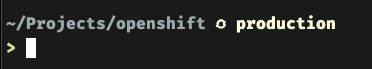

# OpenShift Cluster Manager Spaceship Plugin

This plugin will query your OpenShift Cluster Manager (ocm) configuration to always show which environment you're connected to.

## Prereqs

This plugin requires a [Nerd Font](https://www.nerdfonts.com/font-downloads) to be installed and used by your terminal.

## Installation

Clone this repo, and then move `spaceship-ocm.plugin.zsh` into the `$ZSH/custom/plugins/spaceship-ocm` directory. Next, in your zshrc, add the `spaceship-ocm` plugin name to the plugins line.
